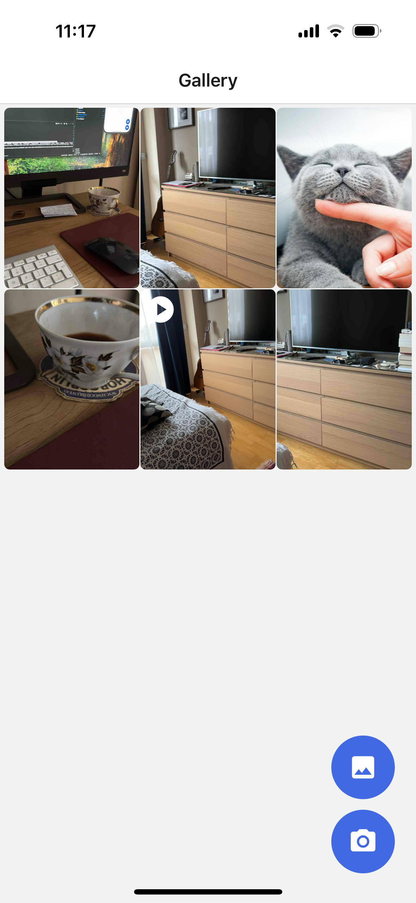
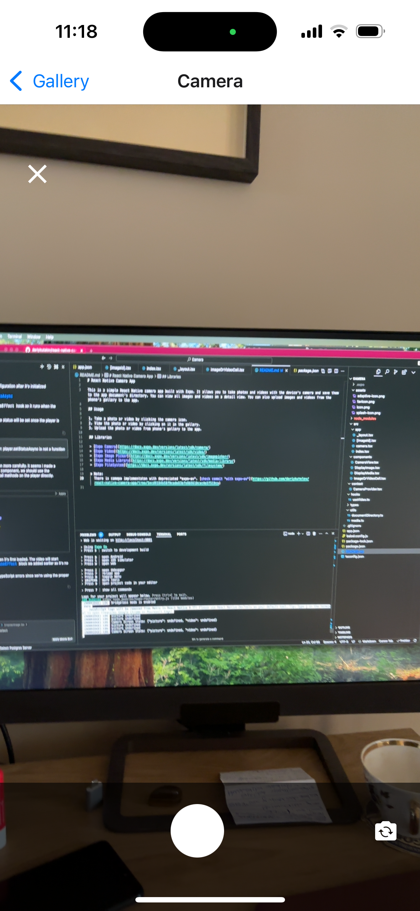
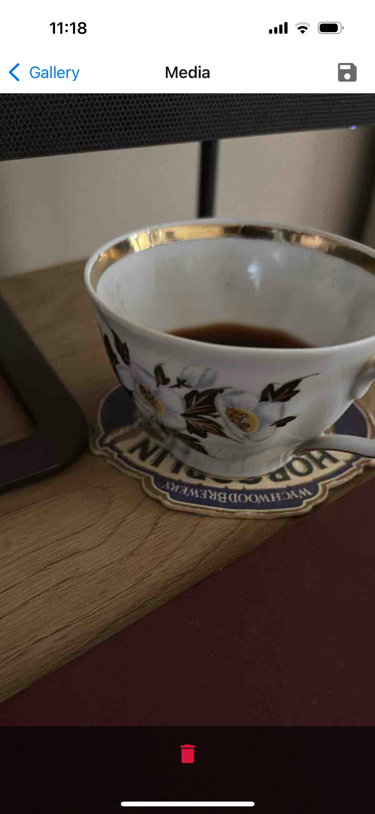
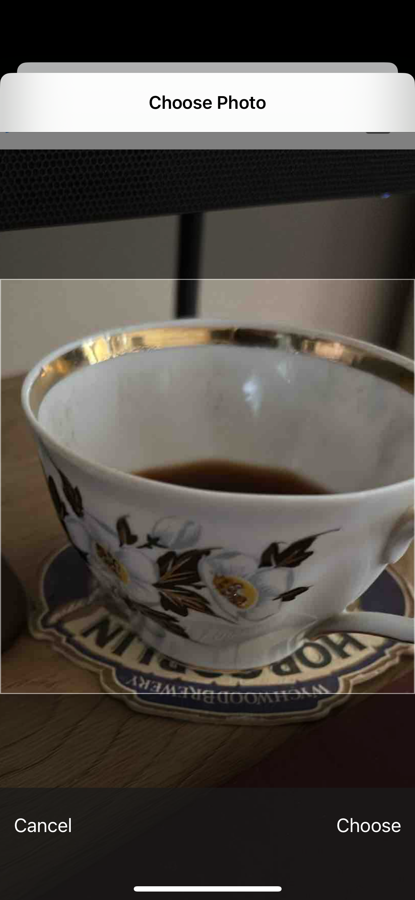

# React Native Camera App

This is a simple React Native camera app built with Expo. It allows you to take photos and videos with the device's camera and save them to the app document's directory. You can view all images and videos on a detail view. You can also upload images and videos from the phone's gallery to the app.

## Usage

1. Take a photo or video by clicking the camera icon.
2. View the photo or video by clicking on it in the gallery.
3. Upload the photo or video from phone's gallery to the app.

## Libraries

- [Expo Camera](https://docs.expo.dev/versions/latest/sdk/camera/)
- [Expo Video](https://docs.expo.dev/versions/latest/sdk/video/)
- [Expo Image Picker](https://docs.expo.dev/versions/latest/sdk/imagepicker/)
- [Expo Media Library](https://docs.expo.dev/versions/latest/sdk/media-library/)
- [Expo FileSystem](https://docs.expo.dev/versions/latest/sdk/filesystem/)

* Note:
  There is camepa implementaton with depreciated "expo-av". [check commit "with expo-av"](https://github.com/dariykutelov/react-native-camera-app/tree/5ecd9184b58f0cade83bfe8b5610cac4e5f519ca)

## App Screenshots

